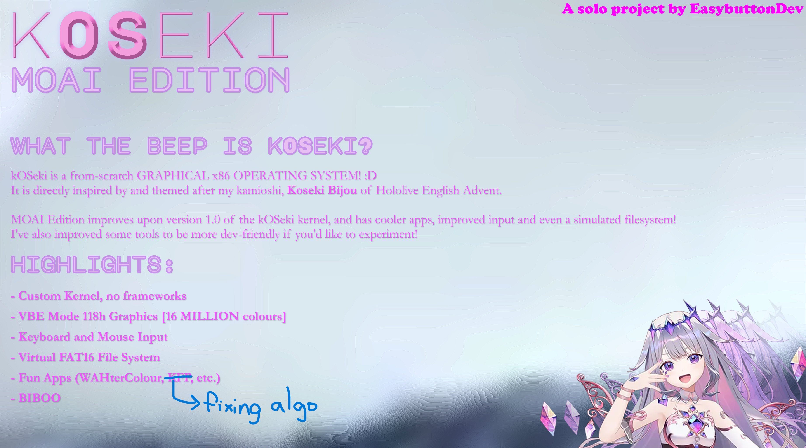
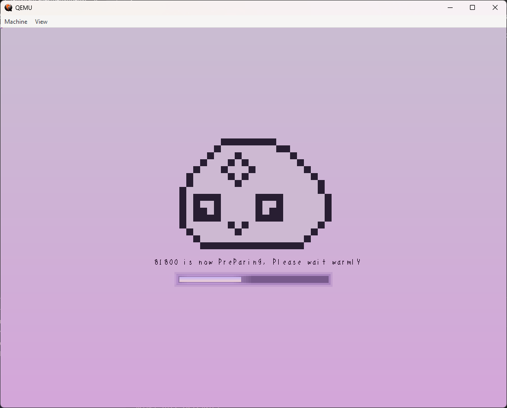
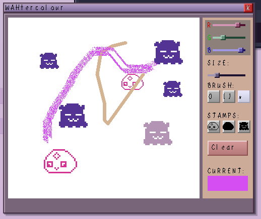
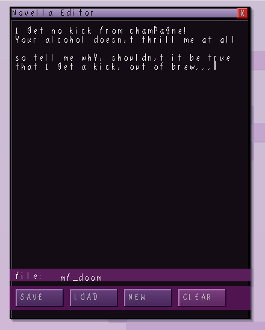
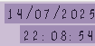
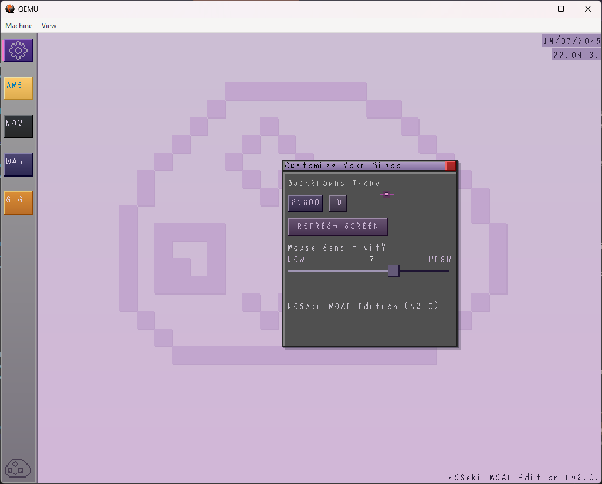
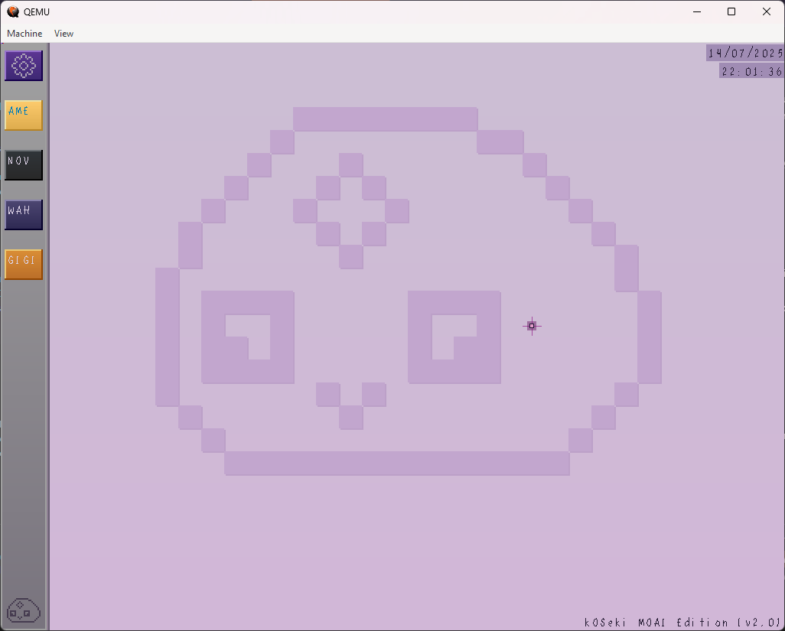
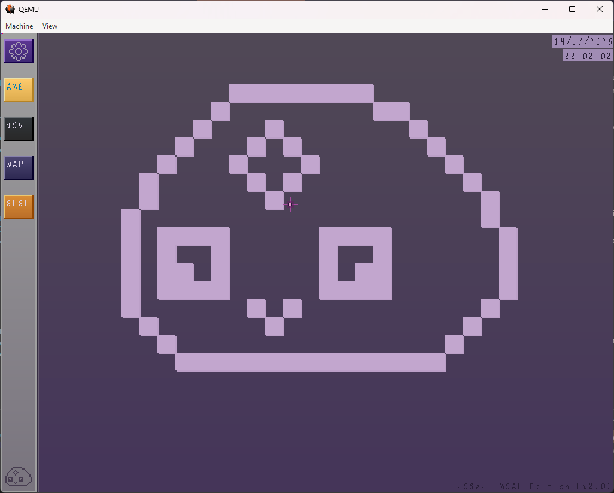

## what the beep is this???

**kOSeki** is a from-scratch operating system, inspired by my kamioshi...
#### Koseki Bijou of Hololive English Advent!

### **About kOSeki v2**

> After nearly half a year, I'm excited to release the new and improved edition of kOSeki!! I've had some weeks off to fix some glaring issues, and add some beeping brilliant features. I've also revised some of the docs so I don't sound like a beta version of Claude with 80% less coding efficiency.

> The next update will be even bigger. While v2 is mostly to polish the current somewhat naive implementation, v3 (tentative) will have the long-postponed backend updates such as an actual filesystem, way less lag, etc. <br>
> As always, your feedback is much appreciated! :D

> Update 17/7/25: It seems that the rock herself has acknowledged kOSeki on X! An unexpected but welcome surprise 🗿

### **HIGHLIGHTS**

- Robust GUI now with 118h -- 16 million beepin colours!
- Modular application system with intuitive structure
- Simulated FAT16 filesystem
- At long last, KEYBOARD SUPPORT. Try it out with Novella Text Editor.
- Support for Gradients and Alpha channel
- Cool apps (I'll likely make more)
- BIBOO
---



---
## **COMPOSITION**

### Bootloader

Single-stage minimal bootloader sets up VBE support, protected mode and GDT. GRUB was another option, but kOSeki is made with the intent of ground-up development.

### VBE Graphics

kOSeki has been updated to support 118h VBE mode, boasting 16 MILLION colours!

It also has alpha-channel support (transparency) and gradient methods, so now the buttons have shiny reflections and the colours look a lot less flat.

As such I've done a graphics overhaul, with stuff such as window shadows, improved themes, etc.

### FAT16 Filesystem

This is probably the one thing that keeps kOSeki from being somewhat of a real OS, and I've patched it somewhat. The new SIMULATED filesystem here has the basic functionality of an actual FAT16 implementation, you can create and delete files, and then edit them with the Novella Text Editor. However, I've yet to fully understand disk access at this point, and I doubt I can fit that in this update. :((

Still, the simulated version works pretty well with the Novella Text Editor, and as long as you don't reboot you'll be able to save and open multiple virtual text files.

### Keyboard Support

Here's a fun one. Ever since I was working on getting proper mouse input, I was experimenting with keyboard input, but it lowkey was not working. And then it turned out I just wasn't calling the keyboard handler method right, so from there I refined it further and voila, a functional (but latent) keyboard input system.

Try this out in Novella Text Editor.

### Window System

kOSeki has a robust window system with draggable and closable windows that house its apps. This makes it easy to intuitively set up apps and utilities.

Due to memory constraints, the maximum number of simultaneous window instances you can open is 8. Beyond that, issues occur (maintenance in progress). 

### WAHterColour
WAHtercolour is a polygonal vector painting app inspired by Ninomae Ina'nis. It's also my personal favourite app in kOSeki.
You get a choice of 3 brushes (Pencil, Highlighter, Spraybrush) in 3 different sizes, and some cool stamps like a Pebble and Takodachi as well.

When I'm done with the filesystem, I'll be adding support to save drawings as images, and perhaps letting you set it as a wallpaper.



### Novella Text Editor

Basically 80% of the new features rely on this wondrous app for visual showcase, but not to worry cause it's pretty cool. It's like a minimal Notepad, and you can write out a short story for Shiori to 'archive' (save to the FAT16 filesystem). You can customise the filename as well. The text cursor can be navigated using the arrow keys if you make a typo.



### Ame CaseFiles

This is where you can view the files you save with Novella Text Editor. While it doesn't really have much ability in terms of file manipulation (renaming, converting, etc.) it at least provides a proof-of-concept for the actual filesystem I plan to implement. You can still shred (delete) files though.


### Shortcuts

When I'm touching grass I bring my laptop along to work on kOSeki. However, because I'm a brainless pebble, the OS has terrible memory management and thus can run really slowly on low-end devices. 

To remedy that I've added shortcuts to open and close apps. Simply press CTRL + [the app index on the taskbar]. (for example if I were to open Novella Text Editor I'd press CTRL+3)

If you want to close an app (which could be difficult if the mouse lags a lot), just press CTRL+X with the app in focus. 

### Gonathan's Quest

I was running out of application ideas so why not settle down with a simple Snake clone. You play as Gigi and basically chase CC. It's rudimentary but pretty fun.


### Kronii ~~'s Stopwatch~~

So it turns out PIT was not needed for timekeeping. instead, kOSeki now utilises the CMOS device clock for fairly accurate time, which you can observe at the upper corner of the OS. The stopwatch will be added back at a later date.



### Settings

Adjust your kOSeki theme and mouse sensitivity here. You can also refresh your screen (it's literally just a button to flush the screen black). Take a look at the gallery for some screenshots of the background themes.



---

## GALLERY




---
## Installation

### User
If you're just looking to try out kOSeki, check the Releases page for the latest 'stable' ISO images.
You'll need to use QEMU-x86 to emulate kOSeki. 

When I'm not developing with kOSeki, I find that it's way smoother to simply drag and drop the kOSeki.iso file onto the qemu-system-x86 executable to run it. This would hide your mouse, and also improve the tracking substantially. 

### Development
If you're looking to modify, fork or simply take a look at kOSeki's code, you'll first need to enter the kOSeki folder.

Recommended Shell:
On Windows, it's best to download WSL and use bash. In my case I'm using Kali Linux, but you can try whatever's suitable for you.
On Linux and Mac, I believe you can use bash directly.

You'll need to install NASM from the command line and ensure tools like Make are set up.

You'll then need to install QEMU either from https://www.qemu.org or through your command line. 
Once you're done, you should be able to start building and running kOSeki.

To remove all binaries:
```make clear```

To build and run your latest changes to kOSeki:
```make```

To run your latest kOSeki build:
```make run```

More of the updated Makefile can be found by running ```make help```.

---

## Credits

Thanks to Koseki Bijou of Hololive English Advent for her inspiration! ROCK ROCK!

Resources used for kOSeki MOAI Edition:

- https://wiki.osdev.org for some insightful documentation
- https://www.reddit.com/r/osdev/ for all the neat tips and cool community projects that kept kOSeki fun to develop
- https://stackoverflow.com/ for compact custom implementations of math/stdio functions such as srand()
- https://www.youtube.com/@dpacarana for his work on OsakaOS which really motivated the development of kOSeki
- https://www.youtube.com/@nanobyte-dev for his brilliant Building An OS series, making OSdev theory a tad easier to grasp.
- Krita was used for the poster and resizing images in this README as well as the OS.

Lastly, thank **you** for trying out kOSeki, the Biboo Operating System!
---

#### kOSeki by **EasybuttonDev**

