# kOSeki

## what the beep is this??

#### kOSeki is a from-scratch monolithic operating system inspired and themed after my kamioshi [Koseki Bijou](https://www.youtube.com/@KosekiBijou)!

As a fanmade hobby project, the overarching goal of kOSeki is to become a stable, fun and experimental kernel for fellow tech enthusiast Pebbles to explore to their limbless heart's content.

Thanks to the support and testimonials of the community as well as Biboo's acknowledgement on X, kOSeki has returned for v3! 

This update is intended to address many of the issues present in v2 and subsequently revamp the system for good. 

## version 3.0 (the beeg one)

kOSeki v3.0 is my largest update thus far, and the first step in making this project fit for casual use (sounds crazy right?).

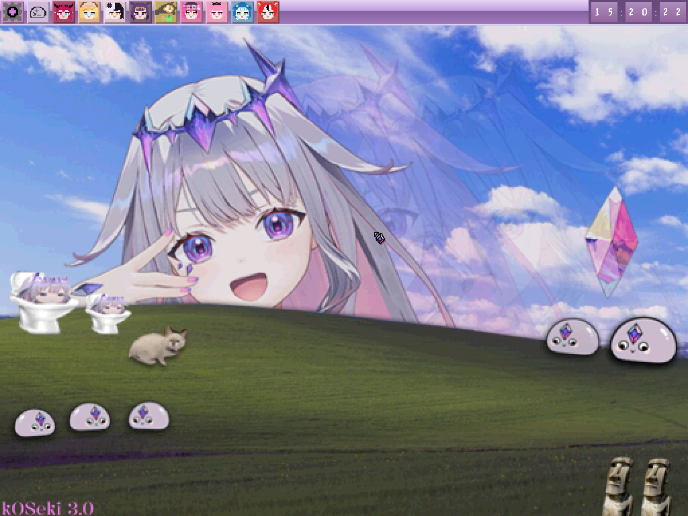

As my naive self from a year ago stated: 
> *While v2 is mostly to polish the current somewhat naive implementation, v3 (tentative) will have the long-postponed backend updates such as an actual filesystem, way less lag, etc.*

In this update, kOSeki has acquired fully revamped graphics and robust backend upgrades such as a proper heap allocator, improved rendering pipeline, and more.
In other words, pretty beepin massive glow-up. (am i speaking too chuuni?)

## **what's new**

- robust VBE 118h GUI (16M colours), with double-buffering, render caches, dirty-rects
- built-in "kernel-space" applications based on the holomems!
- FAT32 filesystem with disk access, multi-dir
- proper image support (lzav-compressed .WAH format & typical formats)
- sound support and synth implementation (AC97 sound card driverr, vocal synth model)
- native weakly-typed interpreted programming language (BAUx2)
- improved keyboard handling
- cooperative multitasking model (by design)
- kernel heap allocator
- mouse that doesn't suck and accurately moves
- networking integration via lwIP and mbedTLS
- multiplayer gaming with MQTT (zamn)
- raytracing demo
- biboo (what else could you want)


## **desktop guide**

### **Preferences**

Preferences allow you to customise your kOSeki system to your liking by changing the wallpaper (more settings will be added soon). 

You can also view your system specs and RAM/disk usage.

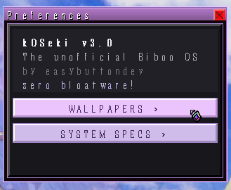
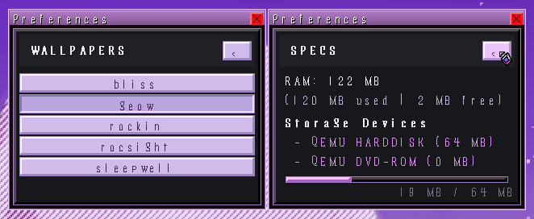


### **Pebbleshell**

Like typical operating systems, kOSeki has a dedicated rock hard command shell for technical usage. You simply type your command and enter (what did you expect).

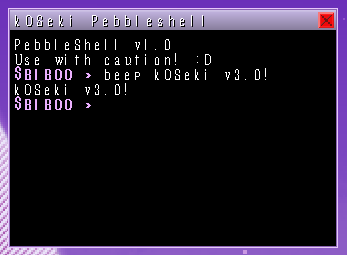

#### **commands**
* `help` - view all commands
* `beep` - echo text to Pebbleshell
* `ls` - list root directory
* `johncat` - read a file
* `rock` - create a file
* `stone` - create a folder
* `nov` - append text to an existing file
* `shiorin` - overwrite an existing file
* `chuuni` / `agent47` - rename a file
* `pickaxe` / `mine` - delete a file
* `peb` - create a Pebble (bundled BAUx2-driven userspace application)
* `clear` - clear Pebbleshell text
* `karaoke` - play an audio file
* `synth` - play a synth
* `br` - play with the BloodRaven opera synth
* `{app name}` - launch an app by typing its name

### **Casefiles**

kOSeki's very own file explorer, themed after Ame. Casefiles are everything to a detective; storing crucial info within their neatly arranged folders.

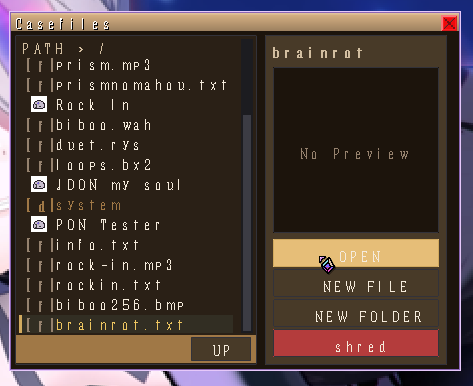

Files are application-associated using their extensions, so you can open them in their respective apps by double-clicking the entry or pressing the 'OPEN' button.

You can also create a new file or folder by pressing the respective buttons and entering a name in the dialog.

Casefiles can also preview your images when you click on them.

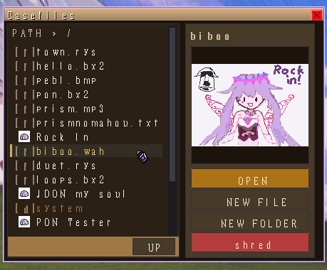

### **Novella**

An Archiver cannot make bookmarks without stories. And how else would you write stories if not for a wonderful notepad? 

Novella is a simple text editor, you can save and load files by pressing the toolbar buttons and entering a filename in the dialogs. (.txt extension is not required as it will sanitise your input.)

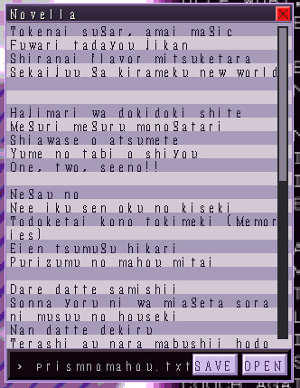

Nothing fancy, right?

### **baudol!**

I lied. Use the shortcut CTRL-B in Novella to toggle BAUDOL IDE mode.

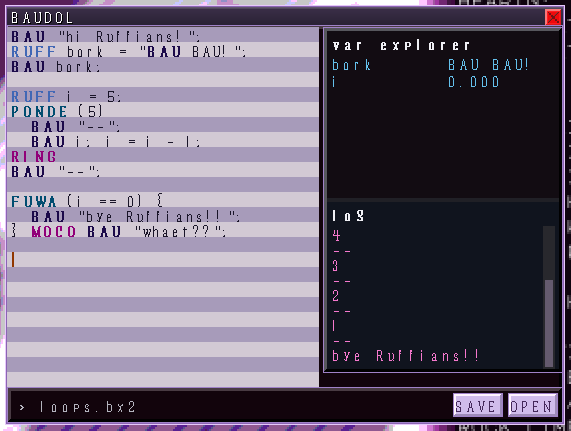

BAUDOL provides an environment for writing and testing your BAUx2 scripts and Pebbles within Novella! All bx2 keywords are bolded and highlighted intuitively, and the side panel has the variable explorer and console log. 

You can run the script with the shortcut CTRL+R.

You can use the var explorer to step through the code line-by-line and observe variable trends.

The log displays the output of the script, as well as any exceptions.

(when saving a BAUx2 file, you must add the .bx2 extension yourself so that Casefiles can automatically open Novella in baudol mode.)

#### **BAUx2**

If you aren't familiar, BAUDOL is actually an old project of mine acting as the development environment for BAUx2, my FUWAMOCO-inspired programming language. It was a horribly-written Rust project which eventually led me to private the repo out of shame. 

To do the twins justice and provide a consistent language for the Pebbles (and Ruffians), I've reinstated it as the de-facto programming language for userspace applications and scripts.

Syntax is fairly similar to basic C, with some stylistic deviations. All instructions must be punctuated with a semicolon (;).

The essential keywords are as such:

| keyword | function | usage |
|-|-|-|
| BAU | prints the argument | `BAU arg` |
| RUFF | defines a variable | `RUFF arg = val` |
| FLUFFY/FUZZY| BAUx2 terminology for TRUE/FALSE| `RUFF baul = FLUFFY` |
| PERO | loops thru enclosed statement set while the condition is true | `PERO (condition) { ... }` |
| PONDE...RING | loops thru enclosed statement set for *n* iterations | `PONDE (n) ... RING` |
| FUWA...MOCO | if/else statements, where MOCO is optional (sorry Mocochan) | `FUWA (condition) { ... } MOCO { ... }` |
| RUFFIAN | defines a callback function | `RUFFIAN fun() { ... }` |
| CHIHUAHUA | force the script to terminate | `CHIHUAHUA` |

Since BAUx2 is designed to support the development of Pebbles, it has access to kOSeki's native GUI pipeline (PON API). If you wish to use PON, you must place the library call at the top of your script: `OFFCOLLAB PON`

Below are the native functions:

| keyword | function | notes |
|-|-|-|
|PON.window(title, width, height) |creates an application window | |
|PON.rgb(r, g, b) | defines a 24-bit colour usable in other functions. | compatible with variable assignment using `RUFF`|
|PON.rect(x, y, width, height, colour) | creates a (filled) rectangle ||
|PON.text(text, x, y, colour, is_bold) | creates text | is_bold must either be FLUFFY/FUZZY |
|PON.button(text, x, y, width, height, colour, callback) | creates a button with click handling | the callback argument accepts a RUFFIAN. similar to C callbacks, no parentheses are required|
|PON.field(x, y, width, height, char_limit, callback) | creates an interactive text field | the callback argument accepts a RUFFIAN. similar to C callbacks, no parentheses are required.|
|PON.read(text_field) | returns text field input as a string | |

here is a sample script (this is packaged as a sample Pebble in the default disk build):

```py
OFFCOLLAB PON;

RUFF win_id = PON.window("oWo notices ur", 350, 250);

RUFF bg_color = PON.rgb(245, 235, 250);
RUFF text_color = PON.rgb(68, 40, 90);

PON.rect(0, 0, 345, 225, bg_color);

PON.text("a button.", 20, 12, text_color, FLUFFY);

RUFF i = 0;

RUFFIAN CALLBACK() {
    BAU "bautton was clicked.";
    PON.text("thanks!", 20, 90, text_color, FUZZY);
    i = i + 1;
    PON.text("clicks: " + i, 180, 90, text_color, FUZZY);
}

PON.button("click me!!", 20, 40, 120, 35, CALLBACK);

PON.text("type >", 20, 110, text_color, FLUFFY);

RUFF inp = 0;

RUFFIAN ON_CHANGE() {
    RUFF read = PON.read(inp);
    PON.text(read, 20, 180, text_color, FUZZY);
}

inp = PON.field(20, 135, 300, 35, 32, ON_CHANGE);

BAU "started app";

```

When running this app (either from Pebbleshell, BAUDOL or Casefiles), the sample Pebble will open the following window:

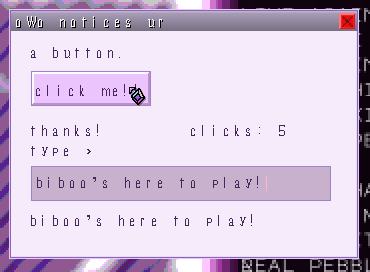


### **WAHtercolour**

WAHtercolour is a paint application themed after Ina! This app has been present since v2 and is now updated with a colour wheel, improved splatter brush, and saving/loading. 

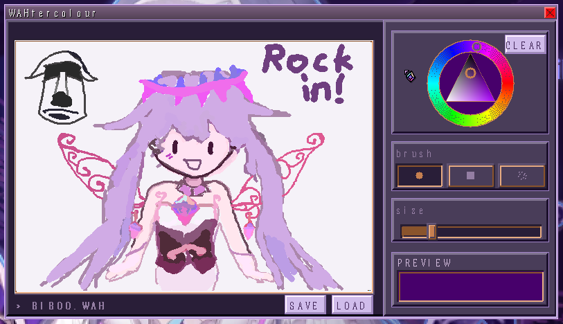

In addition to these features, WAHtercolour now by default saves images with the .WAH format! .WAH is a custom delta-encoded LZAV-compressed format which replaces .BMP (this also gives images much smaller file sizes so everything saves way faster).


### **Shoebox Games**

Can't have Auto without Fister. Shoebox Games is another duo-themed app inspired by Gigi and CC. While the main application is colonised by Gigi, you'll see Cecilia in many of the SBG sprites. 

Shoebox Games introduces multiplayer gaming in kOSeki, through 2 "exciting" games:
- Chaser (snake game)
- 4-BLOX (legally-distinct block-stacking game)

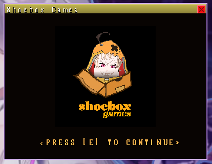

Stuff I'll add in the next 2 updates:
- Binted (boat race)
- GKLM (trivia)
- GremS (grem-sucking game a la hungry hungry hippos)
- collab with another pebble dev??? (fingers crossed)

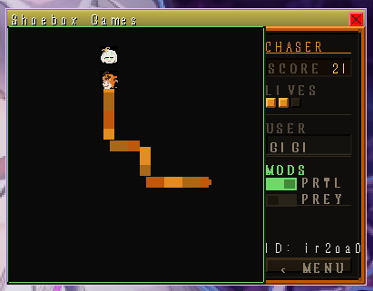

While the games are technically multiplayer (using an MQTT broker to facilitate 8-player rooms), I have only added a live leaderboard for scorekeeping so there's not much PvP interaction. please stay tuned for updates!

### **DOOM**

Your prayers have been answered. DOOM is a Raora-themed DOOM-like game, featuring a climactic showdown against Shiori in a high-octane FPS-style raycasted experience. (theres no limit to the glaze)

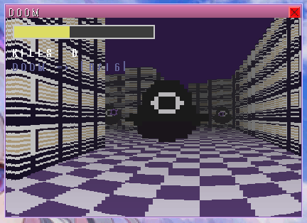

Now I know what some of yall are thinking: "But DOOM doesn't use raycasting, it uses a BSP tree!". My response is that I'm lazy, and raycasting is sufficient for DOOM's current gameplay. However, I will probably switch to a more faithful implementation in v4, maybe by porting doomgeneric or making a flexible retro game engine (possible bossfight?). 

On launch, you'll be at the splash screen. Press 'e' to begin and see the cool ass screen-melt. There's also some pre-dialogue I won't spoil here. 

DOOM has 2 levels. You can also skip straight to the second level with CTRL+2.

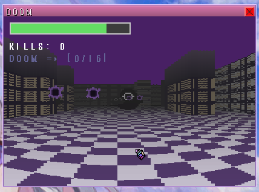

Controls are W/S for moving forwards/backwards, and A/D to look around. 

Press 'E' to shoot enemies. When you have killed 16 Novelites, you can press 'E' again to use DOOM and suck the remaining 8 into a black hole.

### **Carbonated Love Media**

CL Media actually consists of two programs. Because kOSeki's new sound support was so nice I had to do the application twice. Both are themed after IRyS.

### CL Player

CL Player does not appear on the taskbar by default. Instead, it is associated with WAV and MP3 formats and will launch when an audio file is opened through Casefiles. I designed it to look kinda like a cassette.

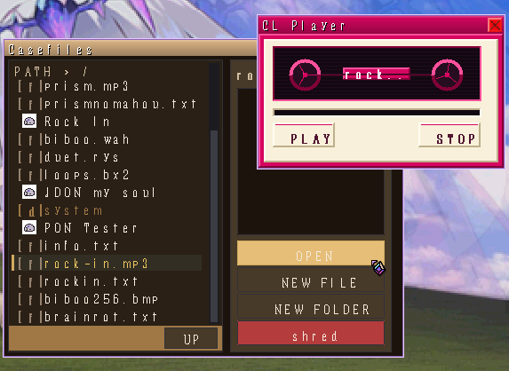

### CL Studio

CL Studio is a full-on DAW for my fellow Pebble producers. Just like other DAWs, CL Studio has multi-track support, an interactive piano roll and instruments. 

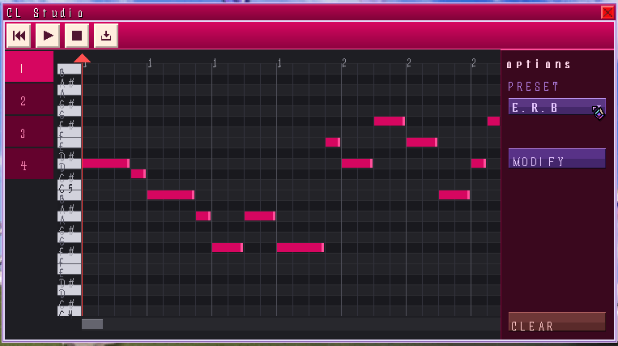

Click on the piano roll to place a note and drag from the right end of a note to extend it.

CL Studio features the BloodRaven Synth, an operatic glottal-pulse formant synth. The plugin can be easily fine-tuned from the control panel, or you can select a preset matching the voices of Nerissa and ERB.

> I am working on an IRyS voice but I'm trying something new first. I was also going to do a kind of visualiser where the chosen voice would do a dynamic singing animation, but I can't do elaborate pixel art so yeah...

### **Reaper Browser**

Networking is arguably the most important component of a modern operating system. Unfortunately, I am not yet ready to implement this from scratch myself. So for v3, I have instead integrated the longstanding lwIP library into kOSeki. It has proved very effective and considering the ease of getting it configured, I decided to make a simple browser for surfing the interwebz.

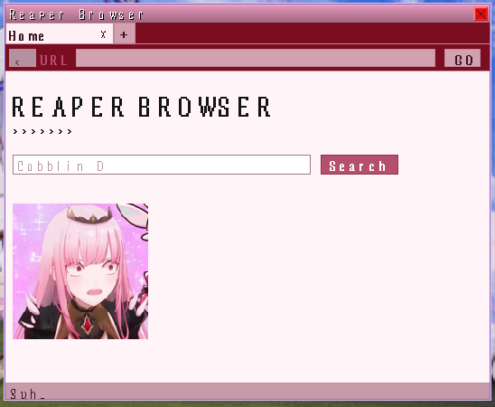

Reaper Browser is a browser themed after Calliope Mori. It can currently handle a fair number of websites, with decent loading times. Please note that due to the relative simplicity of kOSeki's html parsing engine, the formatting is quite basic, supporting just text, images/gifs and some forms. This will be improved upon.

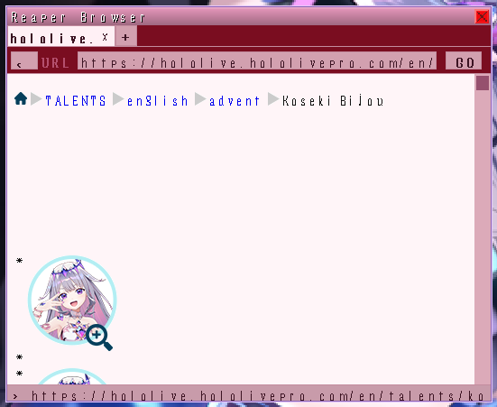

The default search engine for Reaper Browser is lite.duckduckgo.com. 

Below are some sites that work decently:
- info.cern.ch
- lite.cnn.com
- You can search for gifs by typing "{subject e.g. holomem} gifs" and visiting the Tenor result
- You can host a simple html local page on your host machine and visit it from kOSeki by typing your host machine IP. I've left a sample index.html in root for you to try!

### **Gawrculator**

Shork math is real. Gawrculator is a regular calculator most of the time, but will deliberately manipulate the result ~40% of the time. This dum behaviour will be indicated by a gura icon shown beside the result panel.

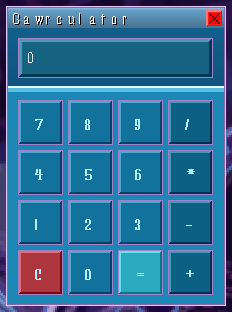
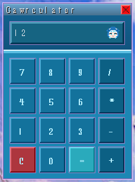

Gawrculator also accepts basic nested expressions, functions (log, ln) and some math constants (e.g. PI, e). You can type these with the keyboard.

Some expressions will return special responses!

For the bold chumbuds who dare to taunt Goomba, escaping her wrath will not be so easy. Certain keywords will prompt her to launch her trident at you. 

Here are a few (try finding the rest or check the source code):

| enter | result |
| - | - |
| `shark`    | `shork`      |
| `biboo`    | `81800`      |
| `67`       | `ROKU NANA!` |
| `kOSeki`   | `:D`         |
| `math`     | angy shork   |
| `gura`     | `A`          |
| `dum`      | angy shork   |
| `/0`       | angy shork   |

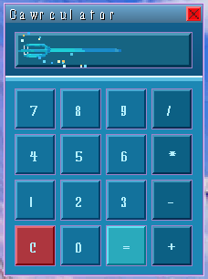


### **Baetracer**

So after seeing DOOM, you might be wondering if kOSeki can handle 'real' 3D. And of course it can! Baetracer is a raytracing demo where you can see the balls of Council float overhead as you Play Dice (say that again).

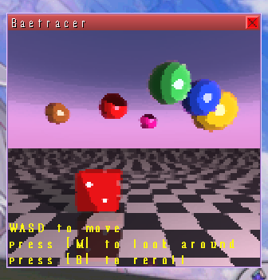

You can explore the scene by using WASD to move and M to toggle look-around (bit of a bug here that I will fix later). To reroll the dice, you can press B. 


## **installation**

kOSeki should be much easier to run for v3! 

You can download the release package at the Releases section, which will provide the pre-built ISO, IMG/VDI FAT32 images, and the curated root folder of media and scripts (all self-made). Since kOSeki v3 stores its assets in the system folder, the IMG/VDI is required to run kOSeki properly.

You will also need a virtualisation software. I have tested Virtualbox and QEMU, which are probably the most straightforward ones to get started on.

**[QEMU](https://www.qemu.org/)**

QEMU is what's commonly known as the more forgiving virtualisation software, so that's where I test kOSeki during development. However, it should hold up even if you're just testing kOSeki out.

The release package contains the kOSeki Agent 4'7 batch script which will walk you through the steps. Just enter the path to the QEMU executable you have installed and choose if you want to use hardware acceleration (WHPX). Ensure that the ISO and IMG are in the same folder as the batch script (they should all be in the package anyway). 

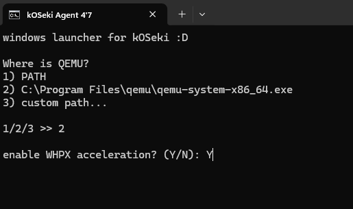

After you've responded to both prompts, kOSeki should boot in QEMU automatically. You might see the following in your Command Prompt:

```
dsound: Could not initialize DirectSoundCapture 
dsound: Reason: No sound driver is available for use, or the given GUID is not a valid DirectSound device ID
```

This is normal and shouldn't affect the sound. If it does, do tell me.

**VirtualBox**

> NOTE: I am trying to fix a very stubborn issue where sound is horrible in VirtualBox and loud. The problem is that this only occurs in VirtualBox, while kOSeki has perfectly fine sound in QEMU. 

> Please consider not using sound-related apps when running in Virtualbox (you can also disable sound output and use the system without audio if you don't need to launch CL Media). As a precaution, lower the sound when you're using Virtualbox for now.

To create a kOSeki virtual machine, go to Virtualbox and click 'New' to open the creation dialog. 

Type a name and provide the ISO Image (kOSeki.iso). The type and version should switch to Other automatically. Under the Hard Disk option, select 'Use an Existing Virtual Hard Disk File' and provide the VDI image (fat32.vdi).

You can press 'Finish' to complete the VM creation. 

To enable net-based services (Reaper Browser, Shoebox Games), you will need to configure the network adapter. Click 'Settings' and go to the 'Network' tab. In Adapter 1, enable the Network Adapter and select the 'Intel PRO/1000 MT Desktop (82540EM)' adapter type. Lastly, press 'OK' to save the changes.

> NOTE: You may also want to reconfigure your VirtualBox Host Key so that it does not conflict with kOSeki's CTRL-involved shortcuts. I'm using Shift+CTRL.

kOSeki is now ready to run! Press 'Start' to activate the VM. 

You will first see the GRUB boot menu (shown below). You can simply press Enter to continue.

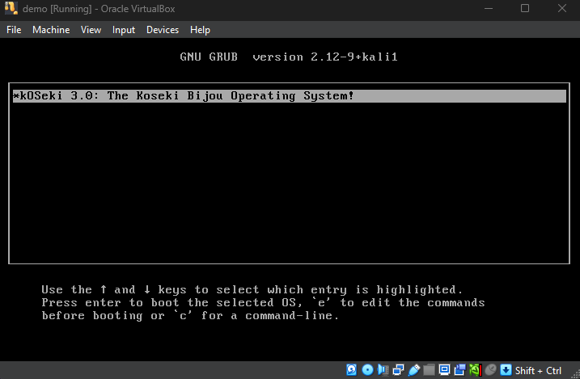

The kOSeki ASCII art should briefly show as it quickly loads the filesystem and switches to the GUI. 

It is normal for the display size to increase to the 1024x768 resolution as this is the regular kOSeki aspect ratio. From experience, the display may be dark for a moment (I'm not sure why this occurs, the long wait in VBox (or when using WHPX) may be due to hardware acceleration). Please wait warmly as the system prepares.

After the boot process, the GUI will display and you will hear the startup sound. kOSeki is ready to use!


## **building from src**

You may want to build from source to either:
- A. Understand and modify kOSeki
- B. Use the system completely with audio

This is also rather straightforward, but will require significantly more installations.

You will firstly require a Linux environment. If you are on Windows like I am, WSL and Kali Linux will do just fine. Once you have set up a Linux environment, you will need to install the following:

* `qemu-system-x86` - particularly `qemu-system-x86_64`

These are likely already installed in your environment by default:
* `build-essential` - make, gcc, basic build tools
* `gcc-multilib` - 32-bit compilation support (`-m32`)
* `g++-multilib` - 32-bit C++ libraries

These may not be in your environment, so please install them as well:

* `binutils` - for `ld`, `objcopy`, and related tools
* `nasm` - assembler
* `grub-pc-bin` - GRUB bootloader files
* `grub-common` - `grub-mkrescue`
* `grub2-common` - additional GRUB utilities
* `xorriso` - ISO creation backend used by GRUB
* `mtools` - FAT filesystem tools
* `dosfstools` - `mkfs.fat`
* `qemu-utils` - disk/image utilities for QEMU

Once they're installed, you should be able to run `make all` to build the OBJs. This process might take a while initially as it builds the external libs. On subsequent builds it should be much faster since it should only rebuild what's changed.

To run the built kOSeki, simply use `make run`. Do note that if you're using WSL, sound may not work due to audio forwarding issues. 

What I do during development is to have a native QEMU installation for Windows. I've added an alternative command named `make run_win` which will use this native QEMU version to run kOSeki. Since the audio pathway is a lot more direct, sound should work well.

To remove the OBJs (excluding external libs), you can use `make clean`. If you need to remove external libs as well, you can use `make clean-libs`. To remove both, use `make distclean`.

If you're developing for kOSeki, you can also check the serial output for the logs sent during runtime. While you can check the serial log within QEMU, you may want to keep the output for analysis to spot warnings/bugs. You can use the `make debug` command which will write the running instance's serial output to  `serial.log` in the source root.

If you want to reformat the disk (for example if you're adding your own files to the initial system), use `make rootfs`. If you want to subsequently produce a VDI to use in VirtualBox, use `make vdi` to convert the current disk image to a VDI.

## **Credits**

Thanks to Koseki Bijou of Hololive English Advent for her inspiration! ROCK ROCK! If it wasn't for this project I genuinely think I'd have learnt next to nothing about computing on my own.

> I know it's been a year or so since v2 dropped, and I haven't made any changes to the repo til now. This was partly due to the complete revamp of the system, but also it makes every release a bit more exclusive. 

> I'll of course be making some small commits in the coming weeks, dealing with all the quirks in 3.0 as well as stuff I left out of the initial release. There's still 2 programs I wanted to add but haven't had the opportunity to try out yet!

> Anyhow, it'll be a while to v4, which is an update that might actually make kOSeki properly useful. In the meantime, I hope v3 (and the subsequent mini-updates) brought you some amusement and interest, as it has for me.

**some key resources & stuff that helped me**:

- https://wiki.osdev.org for some insightful documentation. I'm relying on this a little less now but there's a lot of theory and info that was pretty helpful for understanding basic memory management, sound, etc.
- Regarding the design of BAUx2, [Crafting Interpreters by Robert Nystrom](https://craftinginterpreters.com/) was a great aid. It helped this version of BAUx2 to thrive a lot better compared to the amalgamation that was the 2024-5 Rust version.
- Regarding operatic synths, the values were taken and modified from the Peterson & Barney 1952 paper: [Control Methods Used in a Study of the Vowels](https://www.ee.columbia.edu/~dpwe/papers/PetB52-vowels.pdf), particularly the data of women's formant frequency values (A, E, I, O, U).
- https://www.youtube.com/@dpacarana for his work on OsakaOS which really motivated development. His commentary videos are very pleasant to listen to as well.

Lastly, BEEG thanks to all who checked out v1 and v2, and especially to those who left some suggestions and feedback! And thanks to you for checking out kOSeki v3!