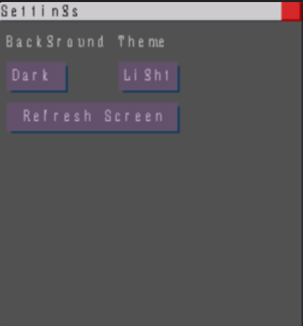
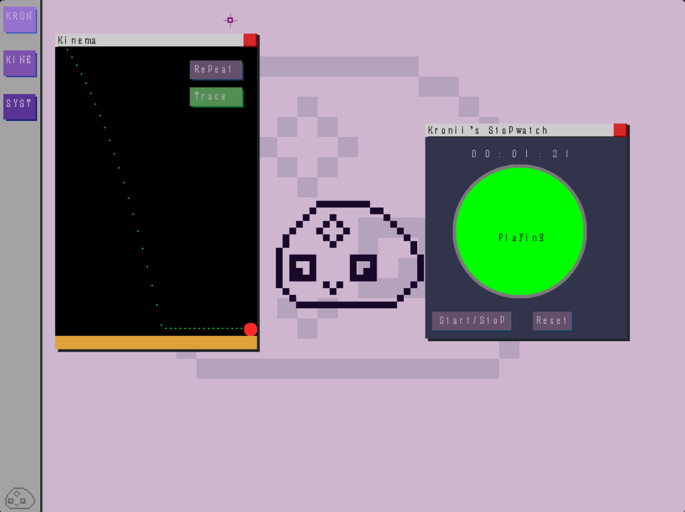

## About kOSeki

**kOSeki** is a ~~j~~gem-themed graphical operating system built from scratch. A technical passion project with a touch of personality!
### ✨ Highlights

- 💎 Built **entirely** from the ground up — no pre-existing kernels or frameworks!
- 💠 **Dazzling** graphical interface using VBE 117h (1024 x 768)!
- 🛠️ Simple file structure for **hassle-free** development!

While kOSeki isn’t a full-featured OS, it's my fun little endeavour into OSDev with a little sparkle!

---
## Features

### 🖥️ Bootloader

The ~~two-stage~~ single-stage minimal bootloader sets up VBE support, protected mode and GDT. GRUB was another option, but kOSeki is made with the intent of ground-up development.

### 💠 VBE Graphics

kOSeki uses VBE mode 117h (That's 1024 x 768) which supports 64000 colours! It would've used 118h for a 24-bit colour system (16 mil colours) but it doesn't load right currently.

### 🪟 Window System

kOSeki has a robust window system with draggable and closable windows that house its apps. Due to memory constraints, the maximum number of simultaneous window instances you can open is 7. Beyond that, issues occur (maintenance in progress). 

At 8 windows, the background goes black and the latest window instance turns black. This is reversible by simply closing some apps and opening the Settings (labeled SYST). Then you can change the background theme back to one of the options. At the 9th window the OS will freeze profusely and trap the mouse at (0, 0). I genuinely do not know why this specifically happens but I'll find out. 

Try to stay below 4 simultaneous windows for best performance.

### ⏱️ Kronii's Stopwatch

kOSeki features an intuitive basic stopwatch straight from the Warden of Time. Just click Start and watch the seconds tick by. Literally, because it's based on system ticks, which probably makes it rather inaccurate on a device faster/slower than a laptop. Right now it seems most accurate at 10 ticks per second with 1 window open. Stay tuned for improvements.


### 🌍 Kinema Physics Simulator

Kinema is a rudimentary simulation of kinematics, or in more generous terms, a physics engine. It's pretty simple but yields quite a neat display. Toggle the Trace for a real-time dotted-line graph of the ball's motion. Then, press Repeat to replay the simulation once more. 


### ⚙️ Settings

Adjust your kOSeki theme and refresh your screen in Settings. Take a look at the gallery for some screenshots of the background themes.



### 🎨 Icons

This was probably the most painful part of kOSeki's early development. My first method relied on converting the image into an array with every 3 elements being the RGB values of a pixel. How naive I was. Beyond around 64 elements it just doesn't appear onscreen. 
So my second try involved those arrays once again, only now I split the image into 16 arrays of 16 elements each. This in fact did work beautifully. However, with how kOSeki is built, it doesn't leave much memory to write anything else. 
My last endeavour relies on binary code in a neat array of 16 elements at maximum. To store several 'images' in the header and call them easily, I placed each array in a larger 2D array. Hence, as the last param of the DrawIconBrand function, you can specify the index of said array and retrieve the image from that index. With a fraction of the memory usage, you get quaint single-colour pixel art. Is it tedious to create images and less attractive than a proper image? Definitely, but at least it has a cute charm to it.

Shown: Previous method vs Current method. A tragic loss, but worth its salt. 


---

## Gallery 📸




---
## Installation

### User
If you're just looking to try out kOSeki, check the Releases page for the latest 'stable' ISO images.
You'll need to use QEMU-x86 to emulate kOSeki. This is because it comes with SeaBIOS (i think).

### Development
If you're looking to modify, fork or simply take a look at kOSeki's code, you'll first need to enter the kOSeki folder.

Recommended Shell:
On Windows, it's best to download WSL and use bash. In my case I'm using Kali Linux, but you can try whatever's suitable for you.
On Linux and Mac, I believe you can use bash directly.

You'll then need to install QEMU either from https://www.qemu.org or through your command line. 
Once you're done, you should be able to start building and running kOSeki.

To remove all binaries:
```make clear```

To build your latest changes to kOSeki:
```make```

To run your latest kOSeki build:
```make run```

---

## Credits

Thanks, of course, to Koseki Bijou of Hololive English Advent for her design influence and inspiration!

Resources used for kOSeki Version 12.2024:

- https://wiki.osdev.org for some insightful documentation
- https://www.reddit.com/r/osdev/ for all the neat tips and cool community projects that kept kOSeki fun to develop
- https://stackoverflow.com/ for compact custom implementations of math/stdio functions such as srand()
- https://www.youtube.com/@dpacarana for his work on OsakaOS which really motivated the development of kOSeki
- https://www.youtube.com/@nanobyte-dev for his brilliant Building An OS series, making OSdev theory a tad easier to grasp.
- Countless cups of Starbucks' Pink Drink with Strawberry Acai.
- Krita was used for the poster and resizing images in this README as well as the OS.

Lastly, thank you for trying out kOSeki, the Biboo Operating System!
---

#### kOSeki by EasybuttonDev

